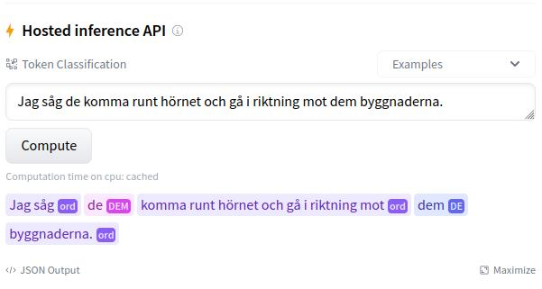

```{r setup, include=FALSE}
knitr::opts_chunk$set(echo = TRUE)
```

Om du vill testa din intuition går det utmärkt att själv använda **DeFormer** -- modellen bakom SpråkpolisenBot. En interaktiv demo finns på [Huggingface](https://huggingface.co/Lauler/deformer). ***Viktigt: Läs instruktionerna nedan först.***

Instruktioner:

1. Använd endast gemener (små bokstäver) för de/dem. För andra ord är det okej att använda versaler.
2. Avsluta helst meningen med skiljetecken (punkt, frågetecken, utropstecken).

Det finns 3 kategorier som modellen predikterar: `ord`, `DE` och `DEM`. Alla ord som inte är `de` eller `dem` ska modellen prediktera som kategorin `ord`. Alla förekomster av `de/dem` ska modellen helst prediktera med kategorierna `DE` eller `DEM`. Se figurtexten ovan för en beskrivning av hur demon används rent praktiskt.

```{r, fig.retina=3, echo=FALSE, fig.cap='Lokalisera "Hosted inference API" på sidan för den interaktiva demon. Du kan själva skriva in en mening i textrutan och trycka på "Compute" för att modellen ska börja prediktera. Det är viktigt att du **använder endast små bokstäver för de/dem**. Avsluta helst också meningarna med skiljetecken (punkt, frågetecken, utropstecken) för bästa möjliga resultat. Modellens prediktioner i bilden ovan har vit text mot en rosalila samt blå bakgrundskvadrat (prediktionerna är i versaler: `DEM` och `DE`). Tryck på "JSON Output" för att få ut hur pass säker modellen är på sina prediktioner.'}

```

Modellen är generellt stark och presterar bra i de allra flesta fall, men har ibland problem när en mening verkligen börjar på "`dem`". Då meningar som inleds på `dem` är relativt sällsynta och har **DeFormer**-modellen förmodligen inte sett trillräckligt många sådana exempel under träningen för att lära sig.

### [Länk till DeFormer](https://huggingface.co/Lauler/deformer)